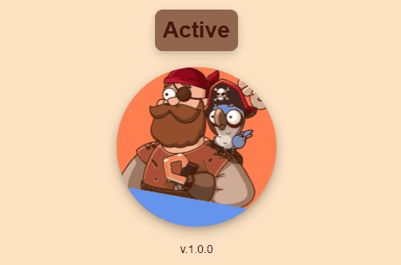
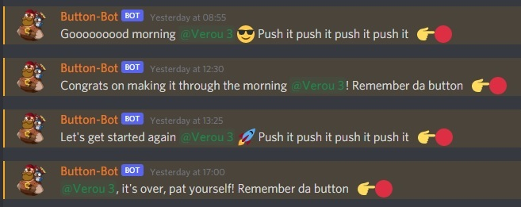

# Discord Button Bot

Maintainer: `Basile Leroy`



> Your leaners will never forget to push the MyBecode button anymore!

A Discord bot that will ping your class in discord to remind the learners to push the button.

- It will send messages to your chat channel of choice!
- It is configurated not to send messages on given holidays and days off.
- After a class is finished, it will also stop pinging that class.



### History
The original bot was build by the amazing Manuele. His version was deprecated causing the bot to disconnect frequently and suddenly. So we made a new one with Discordjs V13 and Nodejs V16.

The Previous bot used to be deployed on Glitch.com but has been moved to Replit.com instead.

## How to make use of the button for your class?

**Disclaimer: you need to have admin rights on your discord server.**

Currently, adding classes to the bot has to be done manually.

Every class is presented as an object in the [config](./Discord/promotions/index.js). An example:
```js
{
    'name': 'Verou 3',
    'channel_id': '111122223333555481',
    'role_id': '99995554455888884',
    'start': (new Date("2021-12-14")),
    'end': (new Date("2022-07-01").setUTCHours(23, 59, 59)),
    'holidays': [
        {
            'start': (new Date("2022-02-28")),
            'end': (new Date("2022-03-04").setUTCHours(23, 59, 59))
        },
        {
            'start': (new Date("2022-05-09")),
            'end': (new Date("2022-05-13").setUTCHours(23, 59, 59))
        }
    ]
},
```
- Make sure that your class name is the same as the one from your in your discord server.
- Channel ID can be found by right-clicking on the channel you choose for the bot to use:


- Role ID can be found by going to the `Server settings>Roles`. There you click the "more" icon and copy the ID.


Finally... Paste your class in the promotions [list](./Discord/promotions/index.js):
`./Discord/promotions/index.js`

## Change Logs

We use the Tagging system to keep track of the new changes. You can follow these in our [change log](https://github.com/becodeorg/button-bot-2022/releases)


## Contributing

> As usual, we adhere to the **boyscouting-rule**: Leave it better than you found it!

### Tools and resources

* Replit hosting (where the bot lives): https://replit.com/@basileLeroy/button-bot-backend#app.js
  * Ask @basileLeroy for invites
  * Auto updated from Github repository
* Cron-job (pinging bot to keep it alive): Currently only access for Basile - still looking for a better option

### 🏎️ Quick fixes

Simple: Small fixes like typo's or small inconsistencies => fix - commit - push.

### ✨ Updates

- Make a new branch
- Apply the updates you want
- [Open a pull request](https://mattstauffer.com/blog/how-to-contribute-to-an-open-source-github-project-using-your-own-fork/) with your suggested changes
- Add the maintainer of the project as a reviewer
- Once at least one of them has reviewed your changes, they will merge the PR for you
- You are now an official contributor, your name will live on in the git annals forever

### 💡 Ideas and Suggestions

Do you have an idea or suggestion? LOVELY! 
- Create an Issue
- Clear title/description
- Clear explanation of the idea
- Add correct label
- Assign a maintainer

### Issues

See [Ideas and Suggestions](README.md#-ideas-and-suggestions)


